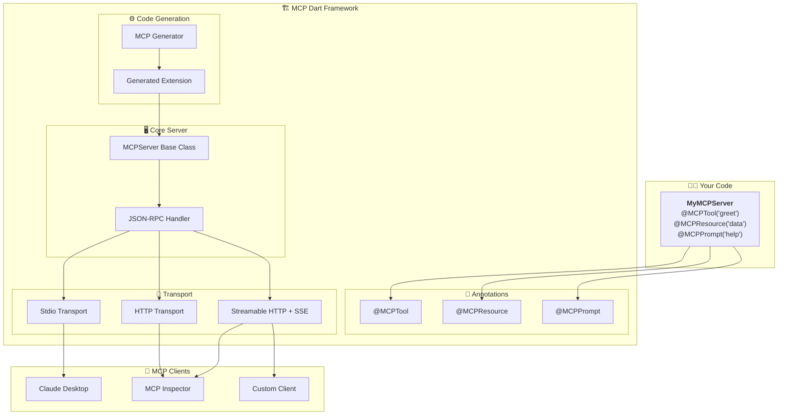

<picture>
  <source media="(prefers-color-scheme: dark)" srcset="@https://raw.githubusercontent.com/Zfinix/dart_mcp/main/logo-dark.svg">
  <source media="(prefers-color-scheme: light)" srcset="@https://raw.githubusercontent.com/Zfinix/dart_mcp/main/logo-light.svg">
  
</picture>
</br>
</br>


[](https://dart.dev)
[](https://modelcontextprotocol.io/)
[](https://opensource.org/licenses/MIT)


A **developer-friendly MCP (Model Context Protocol) framework for Dart** with **annotations** and **code generation**. Build MCP servers as easily as annotating methods with `@MCPTool`, `@MCPResource`, or `@MCPPrompt` - similar to how `json_serializable` or `freezed` works.


## ✨ Features

- **🏷️ Annotation-based**: Declare MCP tools, resources, and prompts with simple annotations
- **🔧 Code generation**: Automatic boilerplate generation using `build_runner`
- **📡 Multiple transports**: Support for stdio, HTTP, and Streamable HTTP with Server-Sent Events (SSE)
- **🔍 Type-safe**: Full Dart type safety with automatic parameter extraction
- **📚 JSON Schema**: Automatic input schema generation from method signatures
- **🧪 Fully tested**: Comprehensive test suite with JSON-RPC command validation
- **⚡ Production ready**: Complete MCP 2025-06-18 protocol implementation with Relic HTTP server
- **🌐 Modern HTTP**: Built on Relic framework with middleware support, CORS, logging, and health checks
- **🔧 Monitoring**: Built-in health check endpoints and connection monitoring
- **📊 SSE Support**: Server-Sent Events for real-time streaming per MCP 2025-06-18 spec

## 🚀 Quick Start

### 1. Add Dependencies

```yaml
dependencies:
  dart_mcp: ^1.0.0
  relic: ^0.5.0  # Modern HTTP framework
  logging: ^1.3.0  # For server logging

dev_dependencies:
  build_runner: ^2.4.13
```

### 2. Create Your MCP Server

```dart
import 'package:dart_mcp/dart_mcp.dart';

part 'my_server.g.dart'; // Generated file

class MyMCPServer extends MCPServer {
  MyMCPServer() : super(name: 'my-server', version: '1.0.0');

  @MCPTool('greet', description: 'Greet someone by name')
  Future<String> greet(String name) async {
    return 'Hello, $name! 👋';
  }

  @MCPTool('calculate', description: 'Perform basic arithmetic')
  Future<double> calculate(double a, double b, String operation) async {
    switch (operation) {
      case 'add': return a + b;
      case 'subtract': return a - b;
      case 'multiply': return a * b;
      case 'divide': return b != 0 ? a / b : throw ArgumentError('Division by zero');
      default: throw ArgumentError('Unknown operation: $operation');
    }
  }

  @MCPResource('status', description: 'Server status information')
  Future<Map<String, dynamic>> getStatus() async {
    return {
      'server': name,
      'version': version,
      'uptime': DateTime.now().toIso8601String(),
      'status': 'healthy',
    };
  }

  @MCPPrompt('codeReview', description: 'Generate code review prompts')
  String codeReviewPrompt(String code, String language) {
    return '''Please review this $language code for:
- Best practices and conventions
- Potential bugs or issues
- Performance improvements
- Security considerations

Code:
```$language
$code
```''';
  }
}
```

### 3. Generate Code

```bash
dart run build_runner build
```

This generates `my_server.g.dart` with registration boilerplate.

### 4. Run Your Server

```dart
import 'dart:io';
import 'package:logging/logging.dart';

void main() async {
  // Enable logging to see server activity
  Logger.root.level = Level.INFO;
  Logger.root.onRecord.listen((record) {
    print('${record.level.name}: ${record.time}: ${record.message}');
  });

  final server = MyMCPServer();
  server.registerGeneratedHandlers(); // Auto-generated method
  
  // Choose your transport:
  await server.start();        // For CLI integration (stdio)
  // OR
  await server.serve(port: 8080);   // For HTTP server with health checks
}
```

**Server Features:**
- 🌐 **HTTP Server**: Runs on specified port with Relic framework
- 🔍 **Health Check**: Available at `http://localhost:8080/health`
- 📊 **Status Endpoint**: Server metrics at `http://localhost:8080/status`
- 📡 **MCP Endpoint**: Streamable HTTP at `http://localhost:8080/mcp`
- 📝 **Request Logging**: All HTTP requests logged with timing
- 🛡️ **CORS Support**: Cross-origin requests enabled by default
- ⚡ **Graceful Shutdown**: Handles SIGINT/SIGTERM signals properly
- 🔄 **SSE Streaming**: Server-Sent Events for real-time communication

## 📖 Annotations Reference

### `@MCPTool`

Marks a method as an MCP tool that LLMs can call:

```dart
@MCPTool('toolName', description: 'What this tool does')
Future<ReturnType> myTool(ParameterType param) async {
  // Implementation
}
```

**Features:**
- Automatic parameter extraction and type checking
- JSON Schema generation from method signature
- Support for optional parameters with defaults
- Async and sync method support

### `@MCPResource`

Marks a method as an MCP resource that provides data:

```dart
@MCPResource('resourceName', 
  description: 'What this resource contains',
  mimeType: 'application/json'  // Optional
)
Future<Map<String, dynamic>> getResource() async {
  // Return resource data
}
```

### `@MCPPrompt`

Marks a method as an MCP prompt template:

```dart
@MCPPrompt('promptName', description: 'What this prompt does')
String generatePrompt(String context, String task) {
  return 'Generated prompt based on $context and $task';
}
```

### `@MCPParam`

Provides additional metadata for parameters:

```dart
@MCPTool('example')
Future<String> example(
  @MCPParam(description: 'The user name', example: 'John Doe') 
  String name,
  
  @MCPParam(required: false, description: 'Age in years')
  int age = 25,
) async {
  return 'Hello $name, age $age';
}
```

## 🌟 Complete Example

See the [Google Maps MCP example](example/lib/advanced/google_maps.dart) for a comprehensive demonstration:

```dart
class GoogleMapsMCP extends MCPServer {
  GoogleMapsMCP() : super(name: 'google-maps-mcp', version: '1.0.0');

  @MCPTool('searchPlace', description: 'Find places by name or address')
  Future<Map<String, dynamic>> searchPlace(String query, int limit = 5) async {
    // Implementation with mock Google Maps API calls
  }

  @MCPTool('getDirections', description: 'Get directions between two points')
  Future<Map<String, dynamic>> getDirections(
    String origin, 
    String destination, 
    String mode = 'driving'
  ) async {
    // Implementation
  }

  @MCPResource('currentLocation', description: 'Current user location')
  Future<Map<String, dynamic>> getCurrentLocation() async {
    // Implementation
  }

  @MCPPrompt('locationSummary', description: 'Generate location summaries')
  String locationSummaryPrompt(String location, String summaryType = 'general') {
    // Generate contextual prompts
  }
}
```

## 🔧 Advanced Usage

### Custom Parameter Validation

```dart
@MCPTool('validateEmail')
Future<bool> validateEmail(String email) async {
  if (!email.contains('@')) {
    throw ArgumentError('Invalid email format');
  }
  // Validation logic
}
```

### Complex Input Schemas

```dart
@MCPTool('complexTool', inputSchema: {
  'type': 'object',
  'properties': {
    'config': {
      'type': 'object',
      'properties': {
        'timeout': {'type': 'integer', 'minimum': 1},
        'retries': {'type': 'integer', 'maximum': 10}
      }
    }
  }
})
Future<String> complexTool(Map<String, dynamic> config) async {
  // Handle complex nested parameters
}
```

### Multiple Transport Support

The server supports both stdio and HTTP transports. You can extend the basic example above to handle command-line arguments:

```dart
// Add argument handling to your main() function:
if (args.contains('--stdio')) {
  print('🔌 Starting MCP server on stdio...');
  await server.start();
} else {
  final port = args.contains('--port') 
      ? int.parse(args[args.indexOf('--port') + 1])
      : 8080;
  
  print('🌐 Starting HTTP server on port $port...');
  print('🔍 Health check: http://localhost:$port/health');
  print('📊 Status: http://localhost:$port/status');
  print('📡 MCP endpoint: http://localhost:$port/mcp');
  
  await server.serve(port: port);
}
```

**Transport Options:**
- **Stdio**: Perfect for Claude Desktop integration and CLI tools
- **HTTP**: Ideal for web applications, testing, and debugging with [Relic framework](https://pub.dev/packages/relic)
- **Streamable HTTP**: Latest MCP 2025-06-18 spec with Server-Sent Events support
- **Health Monitoring**: Built-in endpoints for production monitoring

## 🌐 Streamable HTTP Transport (MCP 2025-06-18)

The MCP Dart framework now supports the latest **Streamable HTTP** transport specification:

### Key Features
- **Single MCP Endpoint**: `POST/GET /mcp` handles all MCP communication
- **Server-Sent Events**: Real-time streaming for server-initiated messages
- **Session Management**: Automatic session ID generation and validation
- **Protocol Headers**: `MCP-Protocol-Version: 2025-06-18` support
- **Security**: Origin validation and localhost binding for development

### Testing with MCP Inspector

```bash
# Start your server
dart run main.dart --example calculator --http --port 8080

# Test with Inspector CLI
npx @modelcontextprotocol/inspector --cli http://localhost:8080/mcp --transport streamable-http --method tools/list

# Test with Inspector UI
npx @modelcontextprotocol/inspector
# Then connect to: http://localhost:8080/mcp with "Streamable HTTP" transport
```

### cURL Testing

```bash
# Initialize connection
curl -X POST http://localhost:8080/mcp \
  -H 'Accept: application/json' \
  -H 'Content-Type: application/json' \
  -H 'MCP-Protocol-Version: 2025-06-18' \
  --data '{"jsonrpc":"2.0","id":"1","method":"initialize","params":{"protocolVersion":"2025-06-18","capabilities":{}}}'

# List tools
curl -X POST http://localhost:8080/mcp \
  -H 'Accept: application/json' \
  -H 'Content-Type: application/json' \
  -H 'MCP-Protocol-Version: 2025-06-18' \
  --data '{"jsonrpc":"2.0","id":"2","method":"tools/list"}'

# Open SSE stream
curl -H 'Accept: text/event-stream' http://localhost:8080/mcp
```

## 🌐 Relic Framework Integration

The MCP Dart framework uses [**Relic**](https://pub.dev/packages/relic) as its HTTP server foundation. Relic is a modern, type-safe web server framework inspired by Shelf but with significant improvements:

### Why Relic?
- **🔒 Type Safety**: No more `dynamic` types - everything is strongly typed
- **⚡ Performance**: Uses `Uint8List` instead of `List<int>` for better performance
- **🛣️ Advanced Routing**: Efficient trie-based routing with parameter extraction
- **🔧 Modern Headers**: Typed header parsing with validation
- **🧪 Well Tested**: Extended test coverage and production-ready

### Server Features Powered by Relic

```dart
// Your MCP server automatically gets these features:
await server.serve(
  port: 8080,
  address: InternetAddress.anyIPv4,
  enableCors: true,  // CORS middleware
  keepAliveTimeout: Duration(seconds: 30),
);
```

**Built-in Endpoints:**
- `GET /health` - Health check with server metrics
- `GET /status` - Detailed server status and capabilities  
- `POST/GET /mcp` - MCP Streamable HTTP endpoint
- `GET /ws` - WebSocket upgrade endpoint (coming soon)

**Middleware Stack:**
- 🌐 **CORS Middleware**: Cross-origin request support
- 📝 **Logging Middleware**: Request/response logging with timing
- 🛡️ **Error Handling**: Graceful error handling and responses
- 🛣️ **Routing**: Automatic route registration and parameter extraction

For more details about Relic's capabilities, see the [official Relic documentation](https://pub.dev/packages/relic).

### Binary Compilation for Production

Compile your MCP server to a native binary for optimal performance and easy deployment:

```bash
# Compile to standalone binary
dart compile exe my_server.dart -o mcp-server

# Cross-platform compilation
dart compile exe my_server.dart -o mcp-server-linux --target-os=linux
dart compile exe my_server.dart -o mcp-server-macos --target-os=macos
dart compile exe my_server.dart -o mcp-server.exe --target-os=windows
```

**Benefits of binary deployment:**
- ✅ **No Dart runtime required** - Standalone executable
- ✅ **Faster startup** - No VM overhead
- ✅ **Easy distribution** - Single file deployment
- ✅ **Production ready** - Optimized performance

**Claude Desktop configuration with binary:**
```json
{
  "mcpServers": {
    "my-server": {
      "command": "/path/to/mcp-server"
    }
  }
}
```

## 🧪 Testing

The framework includes comprehensive testing capabilities with both unit and integration testing. Here are several approaches:

### Testing the HTTP Server

With Relic integration, you can easily test your MCP server's HTTP endpoints:

```dart
import 'dart:convert';
import 'dart:io';
import 'package:test/test.dart';

void main() {
  group('MCP Server HTTP Tests', () {
    late MyMCPServer server;
    late HttpClient client;
    
    setUpAll(() async {
      server = MyMCPServer();
      server.registerGeneratedHandlers();
      await server.serve(port: 8081); // Use different port for testing
      
      client = HttpClient();
    });
    
    tearDownAll(() async {
      await server.shutdown();
      client.close();
    });

    test('health check endpoint works', () async {
      final request = await client.get('localhost', 8081, '/health');
      final response = await request.close();
      
      expect(response.statusCode, equals(200));
      
      final body = await response.transform(utf8.decoder).join();
      final data = jsonDecode(body);
      expect(data['status'], equals('healthy'));
      expect(data['server'], equals('my-server'));
    });

    test('MCP endpoint works with Streamable HTTP', () async {
      final request = await client.post('localhost', 8081, '/mcp');
      request.headers.set('content-type', 'application/json');
      request.headers.set('mcp-protocol-version', '2025-06-18');
      request.write(jsonEncode({
        'jsonrpc': '2.0',
        'id': '1',
        'method': 'tools/list'
      }));
      
      final response = await request.close();
      expect(response.statusCode, equals(200));
      
      final body = await response.transform(utf8.decoder).join();
      final data = jsonDecode(body);
      expect(data['result']['tools'], isA<List>());
    });
  });
}
```

### Unit Testing Individual Methods

```dart
import 'package:test/test.dart';
import 'my_server.dart';

void main() {
  group('MyMCPServer', () {
    late MyMCPServer server;
    
    setUp(() {
      server = MyMCPServer();
    });

    test('greet method works directly', () async {
      final result = await server.greet('World');
      expect(result, equals('Hello, World! 👋'));
    });

    test('calculate method works', () async {
      final result = await server.calculate(10, 5, 'add');
      expect(result, equals(15));
    });
  });
}
```

### Testing with MCP Inspector

The framework has been tested with the [official MCP Inspector](https://github.com/modelcontextprotocol/inspector):

```bash
# CLI Testing
npx @modelcontextprotocol/inspector --cli http://localhost:8080/mcp --transport streamable-http --method tools/list

# UI Testing
npx @modelcontextprotocol/inspector
# Connect to: http://localhost:8080/mcp with "Streamable HTTP" transport
```

## 📚 Examples

The framework includes several working examples:

### 1. [Basic Examples](example/lib/basic/)
Simple MCP servers with manual registration:
- **Hello World** (`hello_world.dart`): Basic greeting server
- **Calculator** (`calculator.dart`): Mathematical operations
- ✅ Manual tool registration
- ✅ Resource and prompt support
- ✅ Both stdio and HTTP modes

### 2. [Advanced Examples](example/lib/advanced/)
Comprehensive annotation-based servers:
- **Google Maps** (`google_maps.dart`): Location services with multiple tools, resources, and prompts
- **Weather Service** (`weather_service.dart`): Weather API with mock data
- ✅ `@MCPTool`, `@MCPResource`, `@MCPPrompt` annotations
- ✅ Generated registration code
- ✅ Complex parameter handling

### 3. [Main Runner](example/main.dart)
Unified example runner:
- ✅ Runs all examples with command-line selection
- ✅ Supports different transport modes
- ✅ Production-ready deployment examples

### Running the Examples

```bash
cd example

# Install dependencies
dart pub get

# Generate code for annotation-based examples
dart run build_runner build

# Run main example runner (shows all available examples)
dart run main.dart

# Run specific examples
dart run main.dart --example hello-world
dart run main.dart --example calculator  
dart run main.dart --example weather
dart run main.dart --example google-maps

# Run with HTTP server
dart run main.dart --example google-maps --http --port 8080

# Compile examples to binaries
dart compile exe main.dart -o mcp-examples-runner
dart compile exe lib/advanced/google_maps.dart -o google-maps-server
dart compile exe lib/basic/calculator.dart -o calculator-server

# Run compiled binaries
./mcp-examples-runner --example google-maps
./google-maps-server
./calculator-server
```

## 📋 Development Workflow

1. **Write your server class** extending `MCPServer`
2. **Annotate methods** with `@MCPTool`, `@MCPResource`, or `@MCPPrompt`
3. **Run code generation**: `dart run build_runner build`
4. **Call `registerGeneratedHandlers()`** in your main function
5. **Choose transport** (stdio, HTTP, Streamable HTTP) and start server

### Watch Mode for Development

```bash
dart run build_runner watch
```

Automatically regenerates code when you modify annotations.

## 🚀 Production Deployment

### Binary Compilation Workflow

```bash
# 1. Install dependencies and generate code
dart pub get
dart run build_runner build

# 2. Compile to binary
dart compile exe lib/my_server.dart -o dist/mcp-server

# 3. Deploy binary (no Dart runtime needed!)
./dist/mcp-server
```

### Docker Deployment

```dockerfile
# Multi-stage build for minimal production image
FROM dart:stable AS build

WORKDIR /app
COPY . .
RUN dart pub get
RUN dart run build_runner build
RUN dart compile exe lib/server.dart -o mcp-server

# Runtime stage - minimal Alpine image
FROM alpine:latest
RUN apk --no-cache add ca-certificates
WORKDIR /app
COPY --from=build /app/mcp-server ./
CMD ["./mcp-server"]
```

### File Naming Flexibility

The framework supports any file naming convention:

```bash
# Standard Dart files
my_server.dart

# Custom extensions  
weather_server.mcp
api_server.tool

# No extension
weather-server
my-mcp-tool

# Executable scripts
#!/usr/bin/env dart
```

**For code generation with custom names:**
```dart
// Keep logic in .dart files for build_runner
// weather_logic.dart
part 'weather_logic.g.dart';
class WeatherLogic extends MCPServer { /* ... */ }

// Create wrapper with any name (weather-server, no extension)
import 'weather_logic.dart';
void main() {
  final server = WeatherLogic()..registerGeneratedHandlers();
  await server.start(); // For CLI integration (stdio)
  await server.serve(port: 8080); // For HTTP server with health checks
}
```

## 🏗️ Framework Architecture



## 🤝 Contributing

1. Fork the repository
2. Create your feature branch: `git checkout -b feature/amazing-feature`
3. Commit your changes: `git commit -m 'Add amazing feature'`
4. Push to the branch: `git push origin feature/amazing-feature`
5. Open a Pull Request

## 📄 License

This project is licensed under the MIT License - see the [LICENSE](LICENSE) file for details.

## 🙏 Acknowledgments

- Inspired by the [Model Context Protocol](https://modelcontextprotocol.io/) specification
- Built with [source_gen](https://pub.dev/packages/source_gen) for code generation
- HTTP server powered by [Relic framework](https://pub.dev/packages/relic) from Serverpod
- Uses [logging](https://pub.dev/packages/logging) for comprehensive server monitoring
- Comprehensive testing ensures production-ready reliability

## 📊 Project Status

- ✅ **Core Framework**: Complete MCP 2025-06-18 implementation
- ✅ **Code Generation**: Working build_runner integration  
- ✅ **Transport Layer**: Stdio, HTTP, and Streamable HTTP support with [Relic framework](https://pub.dev/packages/relic)
- ✅ **HTTP Server**: Production-ready server with middleware, CORS, logging, health checks
- ✅ **Streamable HTTP**: Full MCP 2025-06-18 spec with Server-Sent Events
- ✅ **Binary Compilation**: Native executable support with dart compile exe
- ✅ **Testing**: Comprehensive test suite with JSON-RPC and HTTP endpoint validation
- ✅ **Examples**: Multiple working examples with logging and monitoring
- ✅ **Production Ready**: Fully tested framework with graceful shutdown
- ✅ **Deployment Options**: Development mode, binaries, Docker, custom naming
- ✅ **MCP Inspector**: Full compatibility with official MCP Inspector UI and CLI

The framework has been thoroughly tested with real JSON-RPC commands, HTTP endpoints, and the official [MCP Inspector](https://github.com/modelcontextprotocol/inspector). The [Relic](https://pub.dev/packages/relic) integration provides a modern, type-safe foundation for production deployments with comprehensive middleware support and full **MCP 2025-06-18 Streamable HTTP** compliance.